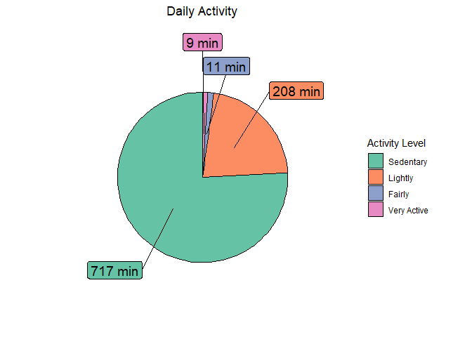

#### **Introduction:**

#### Bellabeat makes health-focused smart products (e.g. Leaf, Time, Spring) and offers a subscription for personalized health guidance.

#### **Statement of business task:**

#### Analyze smart device usage data in order to gain insight into how consumers use non-Bellabeat smart devices. Public data set for analysis [FitBit Fitness Tracker Data](https://www.kaggle.com/datasets/arashnic/fitbit).

#### **Data for analysis:**

#### Reliability: Low (sample of 30 FitBit users, gender/age unknown)

#### Originality: Low (data from third parties via Amazon Mechanical Turk)

#### License : This dataset is under CC0: Public Domain license

#### Comprehensive: Medium (daily activity, calories, steps, sleep, weight records)

#### Current: Medium (data from 2016, habits may have changed slightly)

#### Cited: High

------------------------------------------------------------------------

#### **Statistics review**

#### Data inconsistency noted: 33 users in each table but only 24 in sleep\_day and 8 in weight\_log\_info, suggesting manual entry is not best option for users.

#### Quick stats summary:

#### - Most observations were made Tue-Thu, fewest on Mon

#### - Average daily steps: 8515

#### - Average sleep duration: 419 min

#### - Average active minutes: 42 min

#### - Average sedentary minutes: 712 min

#### - Low minimum values suggest incorrect tracking, likely due to user forgetfulness.

    ##  WeekDay    TotalSteps    TotalDistance    ActiveDistance   TotalMinutesAsleep
    ##  Sun:55   Min.   :   17   Min.   : 0.010   Min.   : 0.000   Min.   : 58.0     
    ##  Mon:46   1st Qu.: 5189   1st Qu.: 3.592   1st Qu.: 0.000   1st Qu.:361.0     
    ##  Tue:65   Median : 8913   Median : 6.270   Median : 1.545   Median :432.5     
    ##  Wed:66   Mean   : 8515   Mean   : 6.012   Mean   : 2.190   Mean   :419.2     
    ##  Thu:64   3rd Qu.:11370   3rd Qu.: 8.005   3rd Qu.: 3.788   3rd Qu.:490.0     
    ##  Fri:57   Max.   :22770   Max.   :17.540   Max.   :13.320   Max.   :796.0     
    ##  Sat:57                                                                       
    ##  ActiveMinutes    SedentaryMinutes TimeSpentAwakeInBed
    ##  Min.   :  0.00   Min.   :   0.0   Min.   :  0.00     
    ##  1st Qu.:  0.00   1st Qu.: 631.2   1st Qu.: 17.00     
    ##  Median : 30.00   Median : 717.0   Median : 25.50     
    ##  Mean   : 42.97   Mean   : 712.1   Mean   : 39.31     
    ##  3rd Qu.: 67.75   3rd Qu.: 782.8   3rd Qu.: 40.00     
    ##  Max.   :275.00   Max.   :1265.0   Max.   :371.00     
    ## 

#### Statistics summary of weight data entered by users manually. The median weight recorded is 62.5 kg, however, this is not very meaningful because the height, age and gender of users are unknown. A more meaningful measure in this case would be the median BMI value which is 24.39 and the average value is 25.19. This is within the range for Overweight according to the following [BMI categories](https://www.nhlbi.nih.gov/health/educational/lose_wt/BMI/bmicalc.htm):

#### - Underweight = &lt;18.5

#### - Normal weight = 18.5–24.9

#### - Overweight = 25–29.9

#### - Obesity = BMI of 30 or greater.

    ##  WeekDay       BMI           WeightKg     
    ##  Sun:10   Min.   :21.45   Min.   : 52.60  
    ##  Mon:12   1st Qu.:23.96   1st Qu.: 61.40  
    ##  Tue: 9   Median :24.39   Median : 62.50  
    ##  Wed:12   Mean   :25.19   Mean   : 72.04  
    ##  Thu:11   3rd Qu.:25.56   3rd Qu.: 85.05  
    ##  Fri: 6   Max.   :47.54   Max.   :133.50  
    ##  Sat: 7

#### The Activity by Hour Statistics Summary shows us that the highest number of observations occurred from Tuesday to Thursday and the the lowest number of observations was recorded on Monday.

    ##  WeekDay       Calories      TotalIntensity     StepTotal      
    ##  Sun:2896   Min.   : 42.00   Min.   :  0.00   Min.   :    0.0  
    ##  Mon:2861   1st Qu.: 63.00   1st Qu.:  0.00   1st Qu.:    0.0  
    ##  Tue:3600   Median : 83.00   Median :  3.00   Median :   40.0  
    ##  Wed:3547   Mean   : 97.39   Mean   : 12.04   Mean   :  320.2  
    ##  Thu:3283   3rd Qu.:108.00   3rd Qu.: 16.00   3rd Qu.:  357.0  
    ##  Fri:2997   Max.   :948.00   Max.   :180.00   Max.   :10554.0  
    ##  Sat:2915

------------------------------------------------------------------------

#### **Correlation review**

#### Examining the correlation between the number of sitting minutes and the number of steps taken per day. The graph displays a weak negative correlation, which indicating that as the number of sedentary minutes increases, the number of steps taken decreases.

#### Examining the connection between the number of steps taken per day and the ease of falling asleep and waking up. This graph compares the number of steps taken and the time spent in bed. The trend line suggests a weak correlation. However, the sample may not be representative, so it cannot be definitively stated that there is no correlation between the number of steps per day and the time spent in bed.

#### The scatter plot suggests that the relationship between steps per day and sleep duration is not strong, indicating that other factors may play a more significant role in affecting sleep duration. Further analysis with more comprehensive data and controlled variables is necessary to confirm or disprove this hypothesis.

#### This observation supports the idea that there is a connection between physical activity and sleep. The correlation suggests that those who get less sleep tend to be less active during the day, which can have a negative impact on overall health and well-being. Further research is needed to fully understand the relationship and potential causes for this correlation.

#### The correlation supports the idea that increased physical activity leads to increased calorie burn, which can be beneficial for weight management and overall health. However, it’s important to note that other factors, such as diet and metabolism, also play a role in calorie burn and should be taken into consideration when evaluating the impact of physical activity on weight and health

#### The graph shows a slight negative correlation between active minutes per day and body mass index (BMI). However, the number of observations is limited, which means that the correlation might not be significant. Further analysis with a larger sample size is necessary to make a conclusive determination of the relationship between active minutes and BMI.

------------------------------------------------------------------------

#### **Activities by hour**

#### The average number of calories burned per hour is most active from 16:00 to 19:00 pm. This pattern may suggest that people are more active during the evening and early night hours. However, this should be interpreted with caution as it could also be due to factors such as availability of time and personal preferences for exercising at certain times of the day.

#### The average number of steps taken per day is highest from 16:00 to 19:00 pm.

#### The most active hours are from 16:00 to 19:00 pm. Following the latest [scientific research](https://pubmed.ncbi.nlm.nih.gov/35481335/#:~:text=The%20results%20of%2011%20studies,12%20studies%20found%20no%20differences) there is no consistent evidence that physical activity at one time of day provides more favorable health benefits than physical activity at a different time of day. It’s important to track the user’s habits and encourage consistency in their physical activity.

------------------------------------------------------------------------

#### **Activities by day of the week**

#### The average number of steps reaches peaks of activity on Saturday, quite active days are Monday and Tuesday. The least active day is Sunday.

#### The most active days in terms of physical activities are Monday and Tuesday, as well as Saturday. The least activity is observed on Wednesday and Friday.

#### On average, users sleep the most on Sundays and Wednesdays, the least on Thursday.

#### Since the most active days in terms of steps taken and training are Monday, Tuesday and Saturday, then the average number of calories burned is the highest on these days.

#### The most sedentary days are Monday, Tuesday and Friday.

------------------------------------------------------------------------

#### **Daily Activity**

#### The average number of active minutes per day is 20 minutes, which is close to the [recommended](https://www.cdc.gov/physicalactivity/basics/adults/index.htm#:~:text=We%20know%20150%20minutes%20of,See%20tips%20for%20getting%20started.) daily amount of physical activity. The median value of light activity is 208 minutes a day. However, users spend 717 minutes sedentary, which is almost 12 hours a day, indicating that there is room for improvement in reducing sedentary time.

#### Let’s take the median values because they are the least dependent on outliers, in this case not all users could track their sleep properly. According to the [article](https://www.cdc.gov/sleep/about_sleep/how_much_sleep.html) an adult (18-60 years old) needs at least 7 hours of sleep a day. However, the age of users is unknown, so the estimate is extremely approximate. Thus, 54.2% of users have a good sleep. 25% of users sleep more than 6 hours and need recommendations based on their individual characteristics. 20.8% of users sleep less than 6 hours and should seriously take care of the problem of sleep or track their sleep properly.

#### Following the [article](https://www.medicalnewstoday.com/articles/how-many-steps-should-you-take-a-day) 10,000 steps is the goal we should strive for, but this figure may vary depending on age, gender and goals. 7 500 - 8 000 steps are also a realistic goal for adults. Thus, 25% of users exceed 10,000 or more steps per day. 33.3% complete more than 7,500 steps a day and 41.7% of users need recommendations.

#### 45.8% of users have a median value of active minutes per day of more than 30. 4.2% of users have a median value of active minutes per day of more than 22, which is also not bad and such users should be encouraged for consistency. 50% of users have a median value of less than 22 active minutes per day and need recommendations.

------------------------------------------------------------------------

#### **Conclusions:**

#### 1) We need updated observations and information about users.

#### 2) It’s necessary to provide a way for users to add weight information, such as with smart scales.

#### 3) Send reminders to users to encourage regular activity, normal sleep and more steps. Encourage consistency among those who are already active.

#### 4) 54% of users require serious recommendations regarding their health.

#### 5) Remind users to wear the bracelet regularly.
